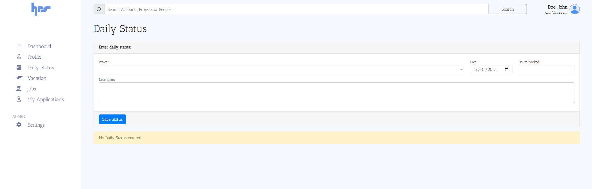

#  HR System

 

A demo of a basic HR system buit using Python and Flask framework. The app provides following functionalities,

- Option to create Roles within the app (like Admin, HR, Manager, Employee) and control CRUD access for each part of the application. Custom roles can also be created.
- Option to create job postings that are publicly available and portal for candidates to register, apply and track their applications.
- Ability for admins to create projects, employees and assign an employee to specific projecst.
- Managers can view all projects, approve vacation requests and reassign employee to a different project.
- HR can view and manage payrolls of each employee and generate payouts for all employees at the month end.
- Admins can track infracture assigned to each employees as well.

#

### Language & Tools

  

### Overview
- The frontend has been crafted using a combination of `Jinja` templates and `Bootstrap`. Jinja templates, a powerful and expressive templating engine for Python, enable dynamic content generation on the client side. Leveraging the flexibility of Jinja, the user interface seamlessly integrates dynamic data and presents it in a user-friendly manner.
- The backend server has been developed using `Python` and the `Flask` framework. 
- All application data is structured based on the models defined in `/main/models`. CRUD operations on the data is enabled  by SQLAlchemy  

### Screenshots

